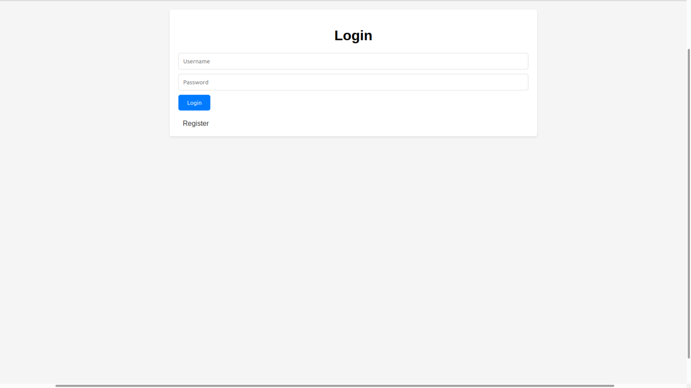
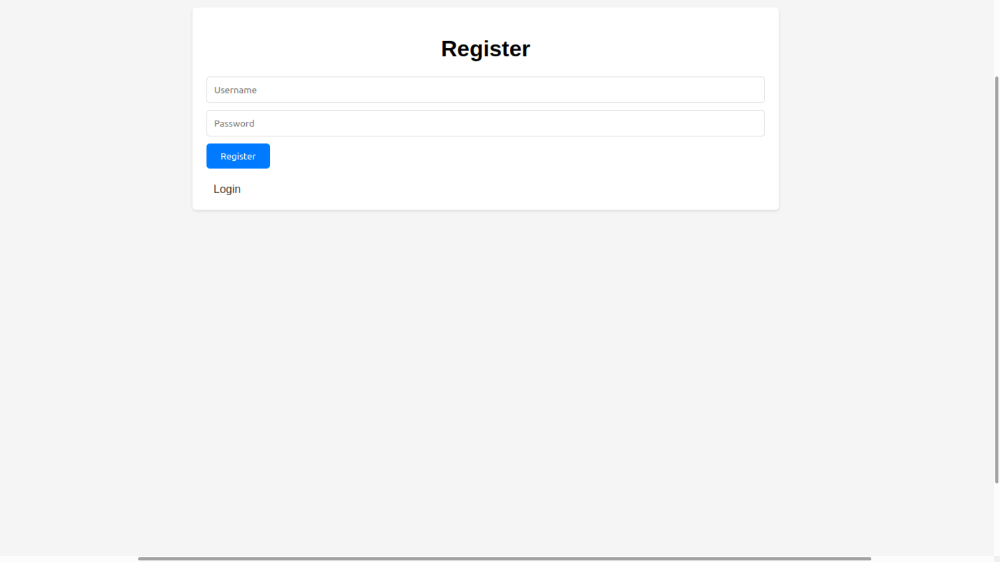
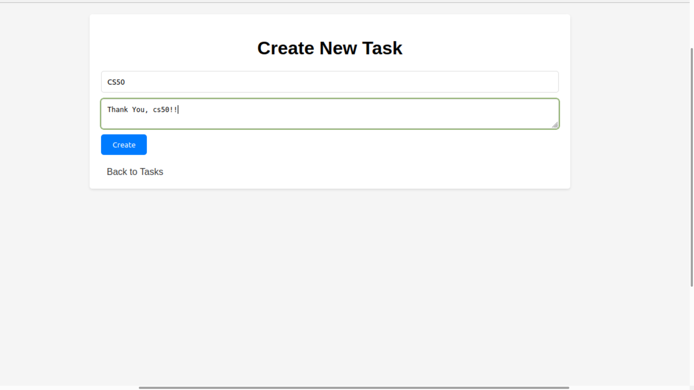
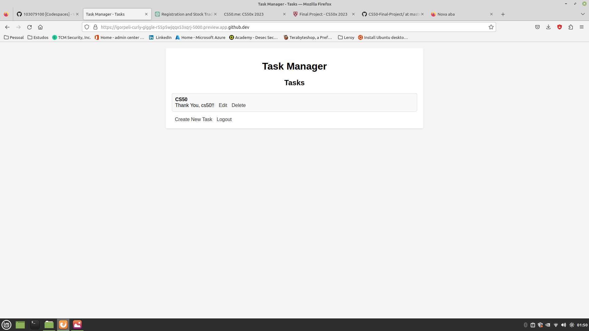
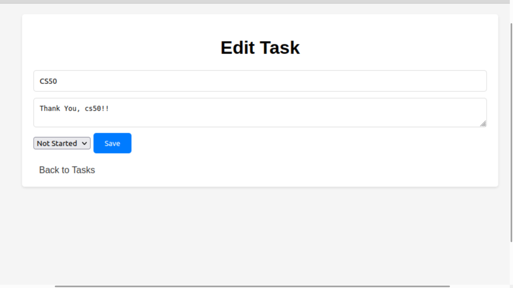
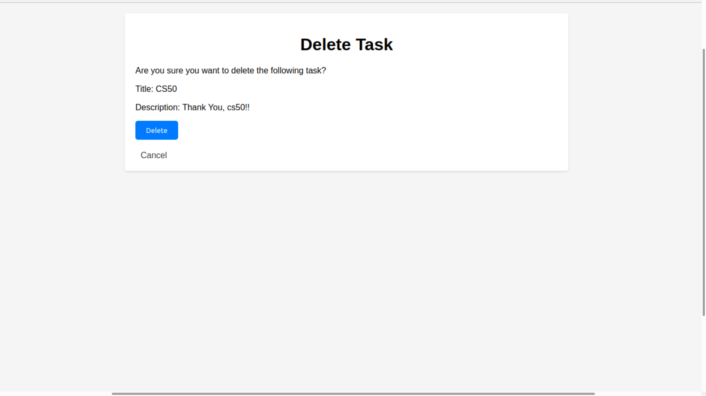

# Project Title: Task Management System
#### Video Demo: <https://www.youtube.com/watch?v=Dg6X9d6qgSo>
#### Description:
The Task Management System is a web application that allows users to create, view, update, and delete tasks. The application provides an intuitive and user-friendly interface where users can efficiently organize their tasks.

## Technologies Used

- Python
- Flask (web framework)
- SQLite (database)
- HTML/CSS
---------------------------------------------------------------------------------------------------------------------------------------------------------------------------------------------------------------
**User Registration and Login**: Users can register for an account by providing a username and password. They can then log in to access their tasks.

| Login | Register |
| :---: | :---: |
|   |  |

**Task Creation**: Users have the ability to create new tasks by providing a title and description for each task.

**Task Viewing**: Users can view a list of their tasks, including the title, description, and status of each task.

**Task Updating**: Users can update the title, description, and status of existing tasks.

**Task Deletion**: Users can delete tasks that are no longer needed.

**User Authentication**: The application ensures secure access to user accounts and tasks by implementing user authentication and password hashing.
The Task Management System aims to help users stay organized and manage their tasks effectively. It provides a convenient platform for individuals or teams to keep track of their to-do lists and prioritize their work.

### File Structure and Description
- app.py: This file contains the main Flask application code. It handles the routing and logic for user registration, login, task creation, viewing, updating, and deletion.
- templates folder: This folder contains the HTML templates used for rendering the different pages of the application.
 - index.html: The template for the homepage, where users can view their tasks.
 - login.html: The template for the login page.
 - register.html: The template for the user registration page.
 - create_task.html: The template for creating a new task.
 - edit_task.html: The template for editing an existing task.
 - delete.html: The template for confirming the deletion of a task.
- static folder: This folder contains static files used in the application, such as CSS stylesheets and images.
 - style.css: The CSS file that defines the styles for the HTML templates.
- task_manager.db: The SQLite database file that stores the user accounts and task data.
- image foder: This folder contains the images.

  ## Explaining the project and the database
    **users**: This table stores user information, including their ID, username, and hashed password.
    **tasks**: This table stores task information, including the task ID, user ID, title, description, and status.

    The project utilizes the Flask web framework and Flask-SQLAlchemy extension to manage the database connections and interactione